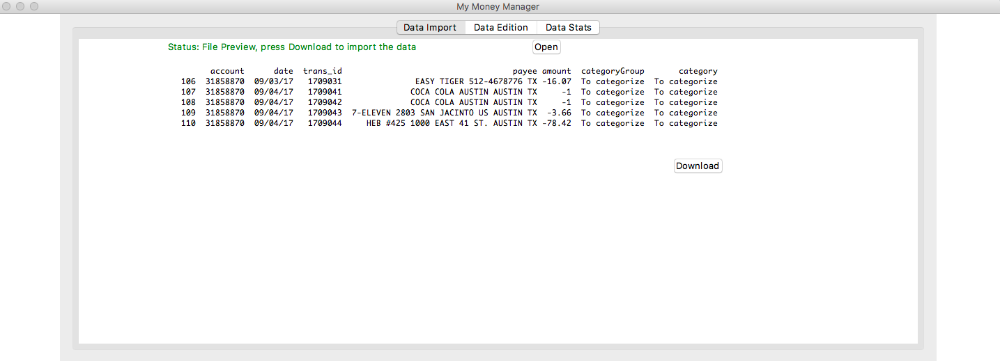
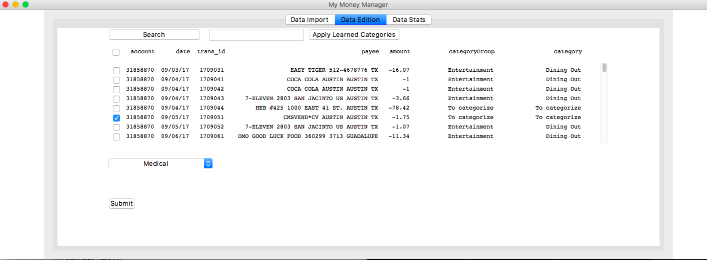
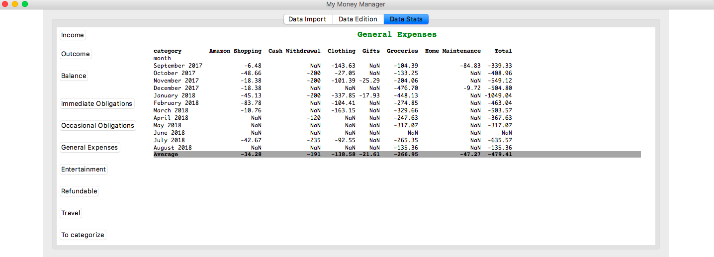

# MyMoneyManager-App

User interface to Visualize, Categorize and Summarize Bank Transactions based on UFCU bank csv files, an open-source software for personal incomes/outcomes management.

New Features (10/10/2018):
------------------------
-Install Procedure
-Bundle App details
-Path bugs resolved

Install
----------------------
1) Download source folder

2) Requirements : python 3.5, pandas 0.17.0

With Miniconda or Anaconda install, do, in the application's folder (where there is a setup.py file) :

        > conda update conda
        > conda env create -f environment.yml

(I created environment.yml using the following command inside my development environment: conda env export | grep -v "^prefix: " > environment.yml )

This creates an environment in Ananconda named MyMoneyManager
NB: the application has been tested only in MacOS Sierra 10.12.6

3) In a terminal, in the application's folder (where there is a setup.py file):

        > source activate MyMoneyManager
        > python setup.py install

4) Create App Bundle on Desktop

        > python create_AppBundle.py
        > source deactivate

5) To launch:

   In a terminal :
   
        > source activate MyMoneyManager
        > MyMoneyManager
        > source deactivate

   In Finder:
     
        Go to Desktop
        Double click on MyMoneyManager icon (MMM)

NB: Imported and Categorized Data saved in ~/Documents/mmmData folder
